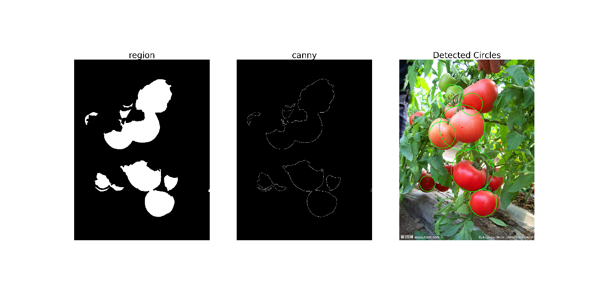
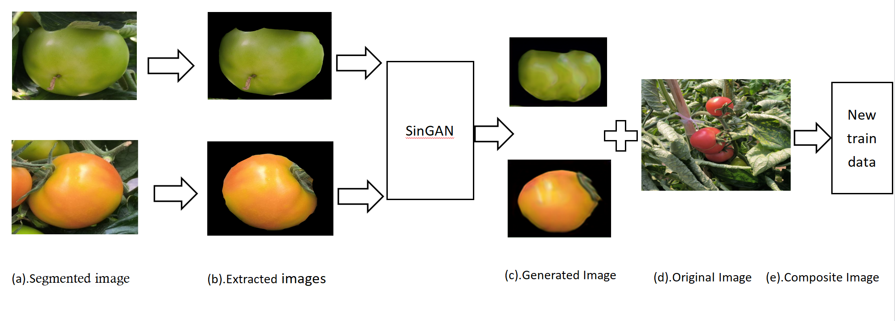
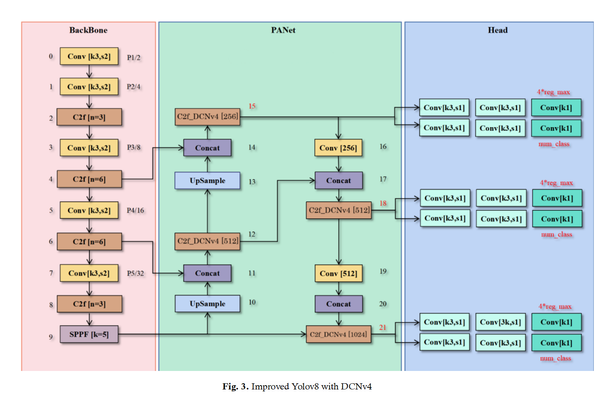

# Tomato was detected separately by the traditional method and the modified YOLOv8

The aim of this project is to compare two different approaches to tomato detection: one based on traditional image processing techniques (using OpenCV) and the other based on deep learning (using YOLOv8). The comparison of these two methods allows us to evaluate the difference in their performance in the tomato detection task.

## Catalogs

- Traditional methods
  - Dependency library
  - Procedure for use
  - Scripting process
  - Caution
  - Conclusion
- Improved YOLOv8
  - Method
    - Data set preparation
    - SinGAN Class Balancing Method
    - Improved YOLOv8 network
  - Experimental

### Traditional_methods
This project aims to detect round tomatoes from a picture containing tomatoes through a series of image processing techniques including color segmentation, median filtering, binarization, morphological operations, edge detection and Hough circle detection. The whole processing process aims to improve the image quality, reduce noise and ultimately detect the circular tomato target accurately.
###### Dependency library
- [OpenCV]  :Used for image processing functions such as reading images, color segmentation, filtering, binarization, morphological operations, edge detection, and Hough circle detection.
- [NumPy]:For working with large multi-dimensional arrays and matrices, and performing efficient mathematical operations.
- [Matplotlib]:For displaying and visualizing images.

###### **Procedure for use**

- 1.Install dependent libraries: make sure OpenCV, NumPy and Matplotlib are installed. you can use the pip command to install them:

```sh
pip install opencv-python numpy matplotlib

```
- 2.Prepare the image: Name an image containing tomatoes as tomato1.jpg and make sure it is located in the same directory as the Python script.
- 3.Run Script: Run the Python script directly. The script will automatically load the image, perform a series of image processing steps, and display the results at the end.
###### Scripting process
- Image reading: a color image named tomato1.jpg is read using OpenCV.
- Color Segmentation: highlight the red region (i.e. tomato) by calculating the difference between the red channel and the green channel.
- Image preprocessing: 
  - 1.Median Filtering: reduce image noise using median filtering.
  - 2.Binarization: converts an image to a binary image by automatically determining the threshold value through Otsu thresholding.
  - 3.Morphological operations: fills holes in binary images using a flood-fill algorithm and performs erosion operations to remove small noise.
- Edge Detection: Detects edges in an image using the Canny edge detection algorithm.
- Hough Circle Detection: Apply Hough Circle Detection algorithm on the edge image to identify round tomatoes.
- RESULTS PRESENTATION: Display the processed image, edge detection results and detected round tomatoes using Matplotlib.
###### Caution
- Make sure that the image file tomato1.jpg exists in the same directory as the script, otherwise you need to modify the file path in the script.
- Parameters for Hough circle detection (e.g. param1 and param2) may need to be adjusted based on the actual image to achieve optimal detection.
- This script may run slower on larger images, especially when performing Hough circle detection.
###### Conclusion
<p align="center">
  <a >
    
  </a>
</p>
This project successfully detected round tomatoes from an image containing tomatoes through a series of image processing steps. This demonstrates the power of OpenCV in image processing and computer vision tasks.

### Improved YOLOv8
In this project, a solution based on an improved YOLOv8s network is proposed to address the need for accurate and efficient monitoring of crop growth status in modern agriculture, especially for the task of accurate detection and segmentation of tomato fruits at different ripening stages. By combining SinGAN class balancing method and deeply optimized YOLOv8 detection algorithm, the solution effectively solves the core challenges of tomato detection, such as class imbalance, difficulty in detecting small targets, and mutual occlusion between fruits.

#### Method

##### Data set preparation

- Data collection: 1,327 original tomato images covering different growth stages, shading degree and distance variation were collected in Changshu Riverside Agricultural Science and Technology Co. in Jiangsu Province.
- Data set division: 231 images were randomly selected as the validation set, 796 images were used as the original training set, and the rest were used for testing.
- Data preprocessing: all images were resized to 1280x960, tomatoes in the images were labeled using Labelme tool and classified as ripe, semi-ripe and unripe based on ripeness.
##### SinGAN Class Balancing Method
<p align="center">
  <a >
    
  </a>
</p>

###### Problem Identifiction
A significant imbalance in the number of tomato samples at the three ripening stages in the original training dataset is found.
###### Solution:
A SinGAN-based class balancing method is proposed to increase the sample size of semi-ripe and unripe tomatoes by generating high-quality and class-balanced synthetic images.

##### Improved YOLOv8s network
<p align="center">
  <a >
    
  </a>
</p>

###### Network architecture

the YOLOv8s model is chosen as the baseline network, which integrates the tasks of object classification, detection, and segmentation in a unified framework.

###### Innovative module 

The C2f-DCNv4 module, which incorporates a fourth generation deformable convolutional network (DCNv4), is designed and introduced and deployed in the neck region of the network architecture to further optimize the feature extraction and representation capabilities.

#### Experimental

##### Performance Evaluation

The effectiveness of the SinGAN-based class balancing method is verified through comparative experiments. The YOLOv8s model trained with the enhanced balanced dataset performs well in the tomato detection task, especially in recognizing half-ripe tomatoes, with a significant increase in average precision (AP).

##### Ablation experiments

the ablation experiments further demonstrate the important role of the C2f-DCNv4 module in improving the overall performance of the network, enhancing the feature extraction capability and improving the accuracy of class-specific recognition.
